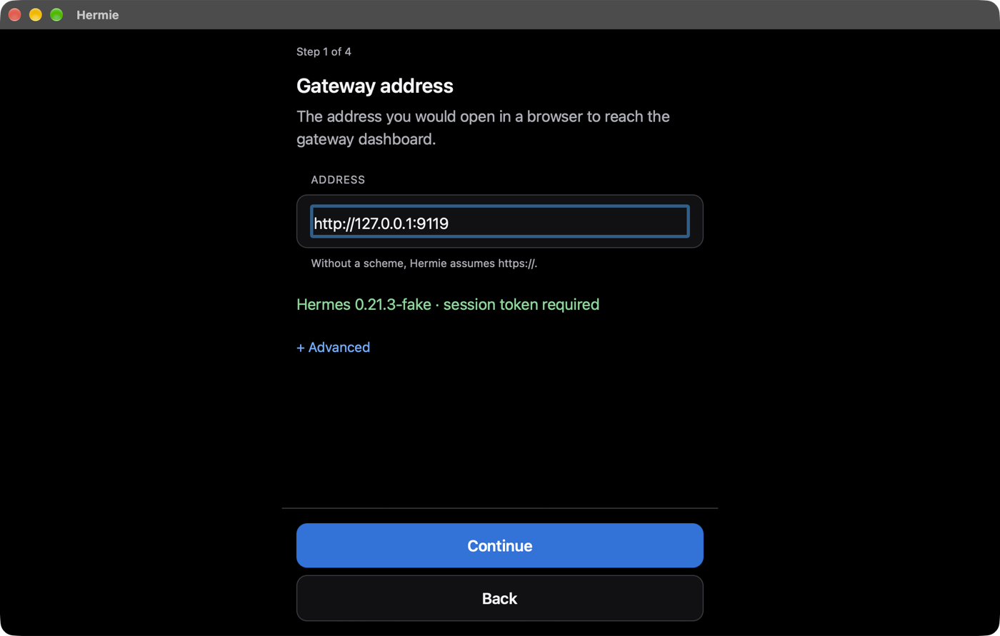

<p align="center">
  
</p>

<h1 align="center">Hermie</h1>

<p align="center">
  A client for <a href="https://github.com/NousResearch/Hermes-Agent">Hermes Agent</a>.<br>
  Your bots, as chats, on your phone, your tablet and your Mac.<br>
  <a href="https://hermie.dev">hermie.dev</a>
</p>

---

Hermes Agent runs agents on a machine you control. Hermie is the client for it:
it points at one gateway, signs in, and turns every bot on that gateway into a
conversation you can open and talk to. Tool calls stream in as they run.
Questions the agent needs answered — a command it wants to run, a detail it is
missing — arrive as a sheet you tap. And when your bots talk to each other, you
see both sides of it, because a reply you cannot trace back to a question is
just a machine talking to itself.

It is one Expo and React Native codebase running on iPhone, iPad, Android and
macOS, and it talks to nothing but your gateway.

<table>
  <tr>
    <td width="33%"></td>
    <td width="33%"></td>
    <td width="33%"></td>
  </tr>
  <tr>
    <td>The chat list</td>
    <td>A conversation, with bot-to-bot traffic in it</td>
    <td>An approval, asked and answered</td>
  </tr>
</table>



## What it does

- **One chat per bot.** Every bot on the gateway gets its canonical conversation,
  with its history, and it stays attached while the app is open so nothing
  arrives late.
- **Tool calls you can read.** Each one is a card: what ran, how long it took,
  and — if you ask for it — the arguments and the result. Three verbosity levels
  decide how much of that is on screen, and it is a view setting, so switching it
  never changes what the gateway does.
- **Bot-to-bot, visible.** A message one bot sends another shows up in both
  conversations, the reply is folded into the message that caused it, and
  **Activity** is one timeline of all of it across every bot.
- **Questions as sheets.** Approvals and clarifications come up as a bottom
  sheet, answered only by an explicit tap, and a question that was answered
  somewhere else says so instead of going stale.
- **Routines.** The gateway's scheduled jobs: what they run, when they run next,
  pause, resume, run now, and the transcript of any past run.
- **Offline-tolerant.** The last stretch of every conversation is cached, so a
  chat paints before the gateway answers and is still readable on a plane.

## What you need

Hermie is a client, not a server. It needs a Hermes gateway you can reach:

- **A running gateway.** `hermes serve`, on the machine that hosts your agent.
  The default port is 9119. Hermie speaks to `/api/ws` and the REST endpoints on
  the same origin.
- **Gateway protocol version 7 or newer.** Hermie checks `desktop_contract` when
  it connects and refuses to run against anything older, rather than failing
  halfway through a conversation.
- **A way in.** A gateway with authentication enabled must offer the native
  sign-in flow — `native_pkce` in `GET /api/status`. Hermie signs in through
  that; it cannot use the browser-cookie flow. A gateway without authentication
  is reached with the session token `hermes serve` prints at startup. Either way,
  if the gateway sits behind an access proxy, extra request headers can be added
  during setup and are then sent with everything, including the sign-in page.

Two things about the gateway's own configuration are worth knowing before you
start:

- **Set `dashboard.public_url`** to the address you actually reach the gateway
  on. It is what makes the gateway build sign-in redirects that come back to
  itself rather than to `localhost`, and a gateway without it will hand Hermie a
  sign-in page that cannot complete.
- **Reach it over HTTPS** if it is not on the same machine. A reverse proxy in
  front of `hermes serve` has to pass WebSocket upgrades through; setup tests
  exactly that before it saves anything, so a proxy that does not will fail
  during setup rather than a week later.

[docs/test-gateway.md](docs/test-gateway.md) is a runbook for standing one up
from scratch.

## Getting it

Hermie has not had a release yet. When it does:

- **iPhone and iPad** — TestFlight _(link to follow)_
- **Android** — Play internal testing _(link to follow)_
- **macOS** — a signed `.app` on the [releases
  page](https://github.com/fullstackstudio/hermie/releases) _(from the first tag
  onwards)_

Until then, and any time you would rather build it yourself:

```sh
git clone https://github.com/fullstackstudio/hermie.git
cd hermie
nvm use                 # Node 22 or newer
npm ci
```

Then pick a platform:

```sh
npm run ios             # iOS simulator
npm run android         # Android emulator or device
npm run macos           # macOS
```

`npm run ios` and `npm run android` generate the native projects on first run;
`ios/` and `android/` are not committed. `macos/` is committed and maintained by
hand — read [CONTRIBUTING.md](CONTRIBUTING.md) before changing it.

You do not need a real gateway to try it:

```sh
npm run fake-gateway -- --auth token --token demo
```

That stands a gateway up on port 9119 with two bots, each with history that
includes a tool call and a bot-to-bot exchange, and a streaming reply for
anything you send. A prompt containing "approve" raises an approval request; one
containing "delegate" fans out subagent activity.

## Setting up a gateway in the app

The first launch opens a wizard, and nothing is written to disk until the last
step — abandoning it halfway leaves no credential behind.

1. **Welcome.** What Hermie is and what it needs.
2. **Gateway address.** The address you would open in a browser to reach the
   gateway dashboard. Without a scheme, `https://` is assumed. Hermie probes it
   while you type and says what it found: the version, and whether it wants a
   sign-in or a session token. **Advanced** takes extra request headers.
3. **Sign in.** On a gated gateway, a "Sign in with …" button per identity
   provider, which opens the gateway's own sign-in page in a forgetful in-app web
   view and reads the result out of the redirect. On an ungated gateway, the
   session token instead.
4. **Test connection.** Required, and invalidated by any change to the fields
   above. It makes one authenticated REST call and then opens the WebSocket
   exactly as the app will during use.
5. **Done.** Now the credentials go to the system secret store and the rest to
   the app's preferences, and the connection starts.

Afterwards, Settings shows the gateway and the live connection status. **Sign
out** clears the credentials and keeps the address. **Change gateway** forgets
everything for that gateway and starts over. If a session expires while you are
using the app, a banner offers to sign in again where you are.

## How it works

One WebSocket, newline-delimited JSON-RPC, to `/api/ws` on your gateway — the
same protocol the official desktop app speaks, from the same sources, vendored
into `packages/hermes-shared` from a pinned upstream commit. Chat history and
long transcripts come over REST on the same origin. Authentication is the
gateway's own native PKCE flow, exchanged for a bearer token; the WebSocket is
dialled with a single-use ticket, minted fresh for every connection, because the
bearer token is not accepted there.

**Where your data goes: to your gateway, and nowhere else.** There is no Hermie
server, no account, no analytics and no third-party network call in the app.
Tokens live in the platform keystore. Transcripts are cached in the app's own
storage so a conversation can paint before the gateway answers. What your bots
say stays between you and the machine you run them on.

## Platforms

| Platform  | State                                                                                                     |
| --------- | --------------------------------------------------------------------------------------------------------- |
| iOS 15.1+ | The primary target                                                                                        |
| iPadOS    | The same build, with a sidebar layout on wide windows                                                     |
| Android   | Builds and runs; exercised least of the four                                                              |
| macOS 14+ | Through react-native-macos. Several Expo modules have no macOS implementation and are shimmed — see below |

macOS is a real target rather than a port, but it is the one with rough edges:
there is no keystore-backed secret store yet, so a macOS build is a development
build rather than something to point at a production gateway.
[docs/platform-notes.md](docs/platform-notes.md) records what is shimmed and why,
and [SECURITY.md](SECURITY.md) states the gap plainly.

## Roadmap

| Milestone                                                      | State       |
| -------------------------------------------------------------- | ----------- |
| Skeleton: one codebase on four platforms                       | Done        |
| The protocol sources and the connection state machine          | Done        |
| Setup and sign-in                                              | Done        |
| Bot chats: streaming, tools, approvals, reconnection           | Done        |
| Bot-to-bot messages, subagents and the Activity timeline       | Done        |
| iPad and macOS layout, the transcript cache, image attachments | Done        |
| Routines                                                       | Done        |
| Release: icons, build profiles, signing, this README           | In progress |

After that: paging back through long history, notifications, and an Android pass
that deserves the name.

## Contributing

Issues and pull requests are welcome. [CONTRIBUTING.md](CONTRIBUTING.md) covers
the toolchain, the checks that have to pass, and the conventions that are easy to
get wrong — the vendored protocol sources and the hand-maintained macOS project
in particular. [CODE_OF_CONDUCT.md](CODE_OF_CONDUCT.md) applies.

Security issues go privately to the address in [SECURITY.md](SECURITY.md), not
into an issue.

The repository is an npm workspace:

```
apps/hermie              the Expo app, including the macOS project
packages/hermes-shared   protocol sources vendored from Hermes Agent
packages/gateway-client  connection state machine, credentials, PKCE — no React
packages/transcript      the chat engine: item model, reducer, reconciliation, selectors
packages/fake-gateway    a gateway stand-in for tests and offline development
design/                  the interface reference and the icon source
docs/                    architecture decisions, glossary, platform notes, runbooks
```

## Licence

MIT, copyright FullStack Studio. See [LICENSE](LICENSE). Third-party code carries
its own notices; see [THIRD_PARTY_NOTICES.md](THIRD_PARTY_NOTICES.md).
