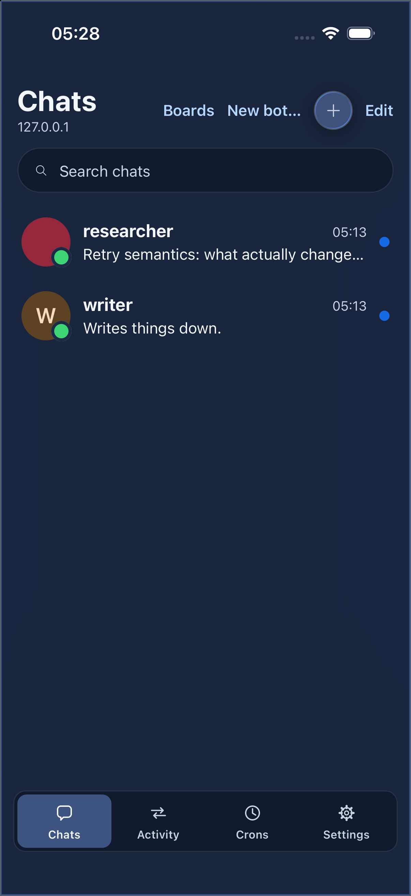
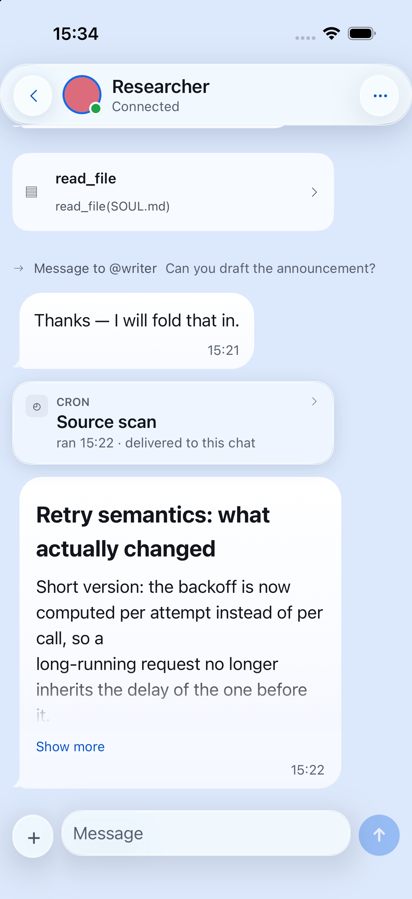
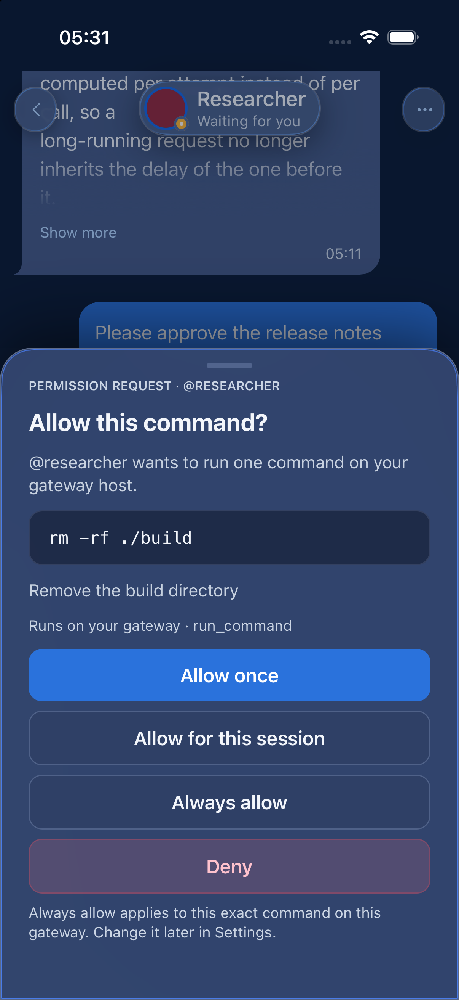
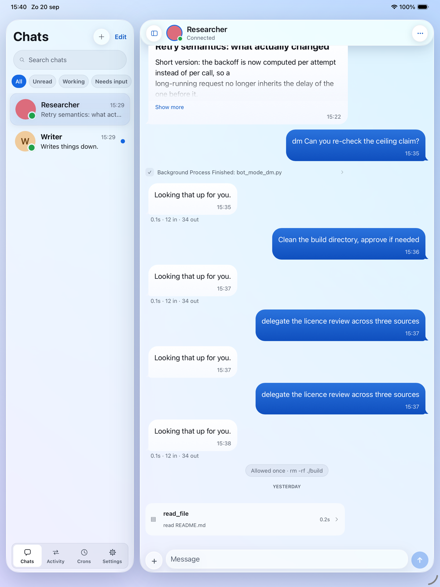

<p align="center">
  
</p>

<h1 align="center">Hermie</h1>

<p align="center">
  A client for <a href="https://github.com/NousResearch/Hermes-Agent">Hermes Agent</a>.<br>
  Your bots, as chats, on your phone, your tablet, your Mac and in a browser.<br>
  <a href="https://hermie.dev">hermie.dev</a>
</p>

---

**Hermes Agent runs agents on a machine you control** — your own server, a
laptop, a box on your tailnet. They have their own prompts, their own tools and
their own memory, and they run commands on that machine. `hermes serve` puts a
gateway in front of them: one WebSocket, a REST surface beside it, and its own
sign-in.

**Hermie is a client for that gateway, and nothing else talks to your bots.** It
points at one gateway, signs in, and turns every bot on it into a conversation
you can open and talk to. Tool calls stream in as they run. Questions the agent
needs answered — a command it wants to run, a detail it is missing — arrive as a
sheet you tap. And when your bots talk to each other, you see both sides of it,
because a reply you cannot trace back to a question is just a machine talking to
itself.

It is for people who already run their own agents and would rather reach them
the way they reach everyone else: from the phone in their pocket, on a train,
without a terminal and without a tunnel to open first.

One Expo and React Native codebase runs in **five places — iPhone, iPad, Android,
the Mac and a browser**. The Mac is not a port: it is the iPad build, which Apple
runs on Apple Silicon unmodified. The browser is not a hosted service: it is the
same app, served by one small process you run next to your own gateway.

What it is not: there is no Hermie server, no account to create, no analytics and
no third-party network call. The only address Hermie knows is the one you typed.

<table>
  <tr>
    <td width="33%"></td>
    <td width="33%"></td>
    <td width="33%"></td>
  </tr>
  <tr>
    <td>The chat list</td>
    <td>A conversation, with bot-to-bot traffic in it</td>
    <td>An approval, asked and answered</td>
  </tr>
</table>

## What it does

- **One chat per bot.** Every bot on the gateway gets its canonical conversation,
  with its history, and it stays attached while the app is open so nothing
  arrives late.
- **Tool calls you can read.** Each one is a card: what ran, how long it took,
  and — if you ask for it — the arguments and the result. Three verbosity levels
  decide how much of that is on screen, and it is a view setting, so switching it
  never changes what the gateway does.
- **Diagrams and mathematics in the reply.** A ` ```mermaid ` flowchart is
  drawn as a picture in the bubble, and `$…$` / `$$…$$` is set as mathematics
  rather than printed as LaTeX. Both are drawn in the app itself — no web view,
  no fonts to download — so a diagram never resizes its own row after you have
  started reading around it. A diagram type or a command outside the supported
  subset falls back to the source in a code block, which is still readable and
  still copyable. [ADR-0020](docs/adr/0020-diagrams-and-math-without-a-webview.md)
  says which subset, and why it is one.
- **Bot-to-bot, visible.** A message one bot sends another shows up in both
  conversations, the reply is folded into the message that caused it, and
  **Activity** is one timeline of all of it across every bot.
- **Questions as sheets, answerable in place.** Approvals and clarifications
  come up as a bottom sheet, answered only by an explicit tap, and a question
  that was answered somewhere else says so instead of going stale. A permission
  request can also be answered from the card in the transcript, without the
  sheet — the buttons are exactly the ones the gateway offered, and answering
  either way takes the sheet down with it.
- **Crons.** The gateway's scheduled jobs, under the name the gateway and its
  dashboard use: what they run, when they run next, pause, resume, run now, and
  the transcript of any past run. A delivery lands in the chat it was addressed
  to as its own card, with the cron itself one tap away.
- **Files and images.** Anything the picker will give you goes up to the gateway
  and into the conversation — a photo, a PDF, a spreadsheet — as its own chip,
  which says while it is uploading and says so on the chip if it is refused.
- **Who is busy, at a glance.** Every chat carries a bead: offline, needs input,
  working, online, in that order of urgency. It is the only thing in the app that
  animates, and only for the one state that is waiting on a person.
- **Your list, arranged your way.** Rows reorder, folders group them — and the
  folders reorder too, held by the same grip and dropped among the chats — chats
  archive, and each one can carry its own colour. None of it is sent to the
  gateway: the arrangement is yours and it is per gateway, because a different
  machine's bots are a different list.

- **The chat's menu is a popover in the chat.** The (…) opens a floating menu
  under the header rather than a sheet that moves the conversation out of the
  way: nothing behind it shifts. Pickers that are genuinely a page — the model
  catalogue, the colours, the mute spans — still open as one, already on the
  page you asked for. On a column too narrow to float a menu in, it is a sheet
  again, decided by measuring the column rather than by asking which device this
  is.

- **Text the size you read at.** Settings › Appearance and the chat's own menu
  carry Small / Default / Large / Extra large, and it changes the size of the
  conversation — the bubbles, the Markdown, the code — and of nothing else. It
  multiplies your device's own text size rather than replacing it.

- **Notifications per chat, not just on or off.** Beyond muting: a bot can stay
  quiet about its scheduled runs and still wake you when a turn fails. A type
  you do not give a chat an opinion about follows the global setting as that
  setting moves.
- **Every message has a menu.** Copy the words or the Markdown, copy any link in
  it, open the other bot's chat, and — on one of your own turns — put it back in
  the composer to send again. On the newest reply, ask for it again: that goes
  through the gateway's own `/retry` where it has one, and re-sends your last
  prompt where it does not. Both are greyed rather than hidden while a turn is
  running.
- **Read a reply aloud.** Any reply's menu will say it, using the voice built
  into your phone, your Mac or your browser — nothing is sent anywhere to be
  synthesised. A code listing is read as `Code block, 12 lines` rather than
  recited, a table is read a row at a time, links read their label, and
  mathematics is read as it was written. A chat can be set to read every finished
  reply on its own, and it never speaks a reply that is still being written.
- **Dictate instead of typing.** A microphone in the composer: hold it to talk,
  or tap it and tap again. What you say appears at the caret as you speak, so it
  drops into a half-written message where you put it, and it is a draft like any
  other — nothing is sent until you send it. On iPhone, iPad, Android and the Mac
  the transcription happens on the device; a browser's speech API does not offer
  that guarantee, and one without the API shows no microphone at all.
- **Voice mode.** Hands-free: it listens, sends what you said, reads the answer
  aloud and listens again. It shows what it heard for a second before sending,
  with a cancel, and it never sends an empty message. Tap to interrupt a reply,
  swipe down or press Escape to leave.
- **Take the conversation with you.** Export a chat as Markdown or plain text,
  into the share sheet on a phone or the Mac and as a download in a browser. What
  you get is what is on screen: a chat you have set to Quiet exports the quiet
  conversation.
- **How much room is left.** The chat's options say how full the session's
  context window is — a ring, the percentage and both counts — refreshed as the
  conversation grows. A gateway that does not report a window size simply does
  not show the row.
- **Make a bot, from the app.** New bot… in the chat list or in Settings: a
  handle, a description, a model from the gateway's own catalogue, and
  optionally another bot's settings to start from. The handle is checked while
  you type it, by the same rules the gateway uses, so a name it would refuse is
  refused before the round trip. The new bot's conversation opens when it is
  made. Deleting a bot is not offered because the gateway does not expose it —
  `hermes profile delete <name>`, on the machine that hosts your agent.
- **What each bot can do.** A bot's profile has Capabilities: its toolsets, its
  skills and its MCP servers, as switches that write as you touch them.
  Changing an MCP server offers to reload the servers for chats that are
  already running, with the gateway's own warning about what that costs — and
  "stop asking" is the gateway's own setting, so it quiets the CLI too.
- **MCP servers.** Settings lists the gateway's servers, what each one is and
  whether it is connected. Open one to test the connection and see the tools it
  offers, or to authorise it if it sits behind OAuth. Nothing is probed until
  you ask: connecting to a server can take seconds, and a page that did it on
  arrival would feel broken while it worked.
- **Skills.** What is installed, with a switch per skill for whichever bot you
  pick, and a search of the hub to install more.
- **Offline-tolerant.** The last stretch of every conversation is cached, so a
  chat paints before the gateway answers and is still readable on a plane.
- **A lock, if you want one.** Face ID, Touch ID, Optic ID or your Android
  fingerprint, with the device passcode behind it — immediately, or after a few
  minutes away. A locked Hermie does not draw its contents behind the plate; it
  does not draw them at all, which is also what the app switcher's snapshot
  gets. The setting lives on the device you made it on and is never synced.
- **Widgets.** A home-screen widget for one chat — avatar, name, bead and the
  last line — one for the three most recent, and on iOS a lock-screen line that
  says how many conversations are waiting on you. Tapping one opens that chat.
  They are drawn from a snapshot the app writes as it goes, which has one
  consequence worth knowing: a widget shows what Hermie last saw, so a phone
  whose Hermie has not run for a week shows a week-old widget. There is no push
  and nothing polls your gateway in the background.

## What you need

Hermie is a client, not a server. It needs a Hermes gateway you can reach:

- **A running gateway.** `hermes serve`, on the machine that hosts your agent.
  The default port is 9119. Hermie speaks to `/api/ws` and the REST endpoints on
  the same origin.
- **Gateway protocol version 7 or newer.** Hermie checks `desktop_contract` when
  it connects and refuses to run against anything older, rather than failing
  halfway through a conversation.
- **A way in.** A gateway with authentication enabled must offer the native
  sign-in flow — `native_pkce` in `GET /api/status`. Hermie signs in through
  that; it cannot use the browser-cookie flow. A gateway without authentication
  is reached with the session token `hermes serve` prints at startup. Either way,
  if the gateway sits behind an access proxy, extra request headers can be added
  during setup and are then sent with everything, including the sign-in page.
- **Behind Cloudflare Access?** Setup has a preset for it: Client ID and Client
  Secret from a service token, kept in the device keystore and bound to that
  gateway's address. Two things to know before you try it. The gateway must be
  on `https://` — a service token is a long-lived credential for your whole
  Access application, so Hermie will not put one on a cleartext connection. And
  **`/auth/*` and `/login` have to be exempt from the Access policy**: a service
  token gets a request past the edge, not a browser, and the sign-in page is a
  browser. See
  [ADR-0021](docs/adr/0021-header-based-front-doors.md).

Two things about the gateway's own configuration are worth knowing before you
start:

- **Set `dashboard.public_url`** to the address you actually reach the gateway
  on. It is what makes the gateway build sign-in redirects that come back to
  itself rather than to `localhost`, and a gateway without it will hand Hermie a
  sign-in page that cannot complete.
- **Reach it over HTTPS if it is exposed to the open internet.** On a private
  network — a tailnet, a LAN, or the same machine — plain `http://` is fine and
  Hermie supports it; see [Keep the gateway off the public
  internet](#keep-the-gateway-off-the-public-internet). If you do put a reverse
  proxy in front of `hermes serve`, it has to pass WebSocket upgrades through;
  setup tests exactly that before it saves anything, so a proxy that does not
  will fail during setup rather than a week later.

[docs/test-gateway.md](docs/test-gateway.md) is a runbook for standing one up
from scratch.

### Keep the gateway off the public internet

A Hermes gateway runs agents that execute commands on the machine it lives on.
That is not something to leave reachable by anyone who finds the address, however
good the sign-in in front of it is. The recommended setup is a private network:
[Tailscale](https://tailscale.com), or [Headscale](https://headscale.net) if you
would rather host the control server yourself. Both use the same clients.

- Put the gateway machine and every device that runs Hermie on the same tailnet,
  and give Hermie the gateway's tailnet name as its address.
- **Plain `http://` is fine on a tailnet.** WireGuard has already encrypted
  everything between the two machines, so TLS on top of it protects nothing that
  is not protected already. Hermie talks to `http://100.x.y.z:9119` or
  `http://host.tailnet.ts.net:9119` as happily as to an https address, says so on
  screen when it does, and only warns when the address is one anybody could be on
  the path to.
- **A name under `.internal` counts as private too.** ICANN reserved that suffix
  for private use and it will never be delegated in the public root, so it is a
  common choice for a Headscale base domain. Hermie states it as calmly as a
  `.ts.net` name. A base domain under a public suffix — `hermes.example.com`
  pointing at a tailnet address — cannot be told apart from any other domain, so
  that one still gets the cleartext warning.
- TLS there is **optional**, and worth the trouble in two cases: an identity
  provider that insists on an `https` redirect URI, and wanting a
  browser-trusted certificate for the dashboard. `tailscale serve` puts one for
  the machine's tailnet name in front of `hermes serve` and passes WebSocket
  upgrades through; with Headscale, a reverse proxy with its own certificate does
  the same job.
- **A self-signed certificate is worse than no certificate here.** Hermie has no
  "trust this certificate anyway", so an address you typed `https://` on in front
  of one simply fails — and on a phone the platform hands JavaScript no reason
  for the failure, so the app can only say it could not reach the gateway and
  name the certificate as one of the two possibilities. Either serve in the clear
  and let Hermie find it, or use a certificate the device already trusts, or
  install your own CA on every device.
- Set `dashboard.public_url` to the address you actually use — **scheme
  included**. It is what the gateway builds sign-in redirects from, so
  `http://host.tailnet.ts.net:9119` and `https://host.tailnet.ts.net` are not
  interchangeable here.
- If the gateway signs you in through an identity provider, the provider's
  sign-in page has to be reachable from the device as well. A public provider
  already is; one that lives on the tailnet is reachable as long as the VPN is up.

Hermie needs nothing special for any of this. It talks to whatever address it is
given, so the VPN only has to be connected before the app is.

## Getting it

Nothing has been published to a store yet. When it is:

- **iPhone and iPad** — TestFlight _(link to follow)_
- **Mac** — the same TestFlight build, or the same App Store listing: Apple
  offers an iPhone/iPad app on Apple Silicon Macs unless it is opted out
- **Android** — Play internal testing _(link to follow)_
- **A browser** — `npx @hermie/web`, or the `hermie-web.zip` a tagged release
  carries; see [Web](#web)

The Android half is the furthest along: the upload key exists, and a tagged build
produces an APK and an app bundle signed with it alongside the web artefacts.
What is left there is registering that key with Play, which happens once per app.
[docs/release.md](docs/release.md) has what is automated and what is still done
by hand.

Until then, and any time you would rather build it yourself:

```sh
git clone https://github.com/fullstackstudio-nl/hermie.git
cd hermie
nvm use                 # Node 22 or newer
npm ci
```

Then pick a platform:

```sh
npm run ios             # iOS simulator
npm run android         # Android emulator or device
HERMIE_APPLE_TEAM_ID=XXXXXXXXXX npm run mac    # this Mac
npm run web:build       # the browser build and the server that serves it
```

The first three generate the native projects on first run; `ios/` and `android/`
are not committed. `npm run mac` builds the iOS app for the "Designed for iPad"
destination and wraps it so macOS will launch it — it needs an Apple Developer
team identifier, because a Mac build has to be signed. `--no-open` builds without
launching, `--debug` builds against Metro.

`npm run web:build` needs no native toolchain at all. Point the result at your
own gateway:

```sh
node packages/hermie-web/bin/hermie-web.js --gateway http://127.0.0.1:9119
```

You do not need a real gateway to try it:

```sh
npm run fake-gateway -- --auth token --token demo
```

That stands a gateway up on port 9119 with two bots, each with history that
includes a tool call and a bot-to-bot exchange, and a streaming reply for
anything you send. A prompt containing "approve" raises an approval request; one
containing "delegate" fans out subagent activity.

## Setting up a gateway in the app

The first launch opens a wizard, and nothing is written to disk until the last
step — abandoning it halfway leaves no credential behind.

1. **Welcome.** What Hermie is and what it needs.
2. **Gateway address.** The address you would open in a browser to reach the
   gateway dashboard. Leave the scheme out and Hermie tries `https://` first and
   `http://` only if nothing answers — and tells you which one it found. Type
   `https://` yourself and it is never downgraded. Hermie probes while you type
   and says what it found: the version, and whether it wants a sign-in or a
   session token. A cleartext address gets one line saying so, which is a
   warning only when the host is not on a private network. **Advanced** takes
   extra request headers.
3. **Sign in.** On a gated gateway, a "Sign in with …" button per identity
   provider, which opens the gateway's own sign-in page in a forgetful in-app web
   view and reads the result out of the redirect. On an ungated gateway, the
   session token instead.
4. **Test connection.** Required, and invalidated by any change to the fields
   above. It makes one authenticated REST call and then opens the WebSocket
   exactly as the app will during use.
5. **Done.** Now the credentials go to the system secret store and the rest to
   the app's preferences, and the connection starts.

Afterwards, Settings shows the gateway — address, host, scheme, port, provider,
version and the live connection status. **Sign out** clears the credentials and
keeps the address. **Change gateway** reopens setup with the address filled in
and keeps everything stored until a different gateway is applied. **Forget this
gateway** deletes both and starts over.

When the connection stops for a reason waiting cannot fix — an expired session,
a gateway that does not trust the address, a rejected certificate, a version
that is too old — the app says so on a card that names the stored address and
offers the ways out: re-check, change gateway, sign out, and a sign-in that
happens where you are. In a browser, where Hermie Web fixes the gateway, it says
that instead of offering setup.

## How it works

One WebSocket, newline-delimited JSON-RPC, to `/api/ws` on your gateway — the
same protocol the official desktop app speaks, from the same sources, vendored
into `packages/hermes-shared` from a pinned upstream commit. Chat history and
long transcripts come over REST on the same origin. Authentication is the
gateway's own native PKCE flow, exchanged for a bearer token; the WebSocket is
dialled with a single-use ticket, minted fresh for every connection, because the
bearer token is not accepted there.

**Where your data goes: to your gateway, and nowhere else.** There is no Hermie
server, no account, no analytics and no third-party network call in the app.
Tokens live in the platform keystore. Transcripts are cached in the app's own
storage so a conversation can paint before the gateway answers. What your bots
say stays between you and the machine you run them on.

## Platforms

| Platform              | State                                                                                                                                                                                                                           |
| --------------------- | ------------------------------------------------------------------------------------------------------------------------------------------------------------------------------------------------------------------------------- |
| iOS 15.1+             | The primary target                                                                                                                                                                                                              |
| iPadOS                | The same build, with a sidebar layout on wide windows — and the sidebar hides                                                                                                                                                   |
| Android 7.0+ (API 24) | Builds and runs, driven end to end on an emulator; a hardware test on a phone and a tablet is scheduled (2026-09-22). The signed release path runs in CI — the upload key exists and CI builds an APK and an app bundle with it |
| macOS, Apple Silicon  | The same build again, as "Designed for iPad" — a window with the sidebar layout                                                                                                                                                 |
| A browser             | Served by Hermie Web, a small process next to the gateway — see **Web** below                                                                                                                                                   |

**On a wide window the chat list is a sidebar, and the sidebar can be put away.**
The chat header's round button hides it, ⌘⇧S brings it back, and the Mac's Chats
menu carries the same item. What is left is a slim rail with the way back and the
Activity, Crons and Settings destinations, so nothing moves further away than one
tap — and the conversation takes every point the list gave up, which on an 11"
iPad in portrait is the difference between a comfortable measure and a narrow one.
On a window too small to hold both, asking for the list back lays it over the
conversation instead of squeezing it again, and it closes as soon as you pick a
chat. Whether it starts open follows the window's width until you say otherwise;
after that it is remembered, per gateway, like the rest of your arrangement.



The Mac is not a separate port. It is the iOS app, which Apple runs on Apple
Silicon Macs unmodified, so it has the same keychain, the same modules and the
same code paths — and one seam, `isiOSAppOnMac`, for the few things a window
should do differently from a tablet. That is a deliberate reversal:
[ADR-0011](docs/adr/0011-mac-via-the-ipad-build.md) records what a native
react-native-macos target cost and why it was dropped, and
[docs/platform-notes.md](docs/platform-notes.md) records what has and has not
been verified on a Mac.

## Web

The fifth place is the one that installs nothing on the device: run one small
process next to `hermes serve` and open Hermie in a browser.

```sh
npx @hermie/web --gateway http://127.0.0.1:9119
# → http://127.0.0.1:9120
```

That process — **Hermie Web** — does two things. It serves the browser build of
the app, and it proxies your gateway onto its own origin, so the page and the
gateway share one address. That is not a convenience: the gateway's session is
an `HttpOnly` cookie, a cookie belongs to an origin, and the gateway refuses a
WebSocket whose `Origin` is not its own — a defence against a page on the
internet pointing a name at your loopback interface and driving an agent that
runs shell commands. Same-origin is what lets Hermie use that session honestly
instead of asking the gateway to relax the guard.

So the browser build signs in the way the gateway's own dashboard does: its
sign-in page, its cookie, and a single-use ticket for each WebSocket dial. The
wizard has no address step, because there is nothing to type — the gateway is
whatever Hermie Web is in front of, and it tells you which one that is.

It binds to `127.0.0.1` and authenticates nobody itself, so anything beyond the
machine it runs on wants TLS in front of it. It can also replace itself: Settings
→ **Hermie Web** shows the running version and offers an **Update** button where
the install shape allows it, which downloads the release zip, checks it against
the release's `SHA256SUMS` and exits for the supervisor to restart.

Three pages, in the order you are likely to want them:
[docs/web.md](docs/web.md) is how it works and why the gateway is reached
_through_ it; [deploy/web/README.md](deploy/web/README.md) is the runbook — Caddy,
nginx and Tailscale Serve configurations, a systemd unit, the Docker image and
the two gateway settings it needs; [ADR-0015](docs/adr/0015-web-variant-on-its-own-port.md)
is the decision and the options that were rejected.

Two things a browser genuinely cannot do, and the app does not pretend
otherwise: there is no keychain (the session stays in the browser's cookie jar,
and clearing site data signs you out), and a page cannot put extra request
headers on a WebSocket — so a gateway behind Cloudflare Access wants the access
proxy in front of Hermie Web rather than configured inside the app. The full
list is the web section of [docs/platform-notes.md](docs/platform-notes.md).

Building it from a checkout:

```sh
npm run web:build   # compiles the server and exports the browser bundle
npm run web         # both, in front of the fake gateway, at http://127.0.0.1:9120
```

## Roadmap

| Milestone                                                    | State       |
| ------------------------------------------------------------ | ----------- |
| Skeleton: one codebase on four platforms                     | Done        |
| The protocol sources and the connection state machine        | Done        |
| Setup and sign-in                                            | Done        |
| Bot chats: streaming, tools, approvals, reconnection         | Done        |
| Bot-to-bot messages, subagents and the Activity timeline     | Done        |
| iPad and Mac layout, the transcript cache, image attachments | Done        |
| Crons                                                        | Done        |
| The interface redesign                                       | Done        |
| The Mac, as the iPad build rather than a port                | Done        |
| Android, built and driven on an emulator                     | Done        |
| Hermie Web: the same app in a browser, same-origin           | Done        |
| Release: TestFlight and Play                                 | In progress |

The automated half of a release is finished: a `v*` tag builds the Android
artefacts and `hermie-web.zip`, signs the Android release with the upload key when
the signing secrets are set, and publishes them with `SHA256SUMS` beside them. The
half that needs an account someone owns is not: nothing has gone to TestFlight or
to Play internal testing yet, and registering the upload key with Play is a
once-per-app step that has not happened.
[docs/release.md](docs/release.md) is the process for both halves, including why a
build signed by a free Apple team stops launching after seven days.

After that: paging back through long history, notifications, and Android on real
hardware — the emulator pass is done and written up in
[docs/platform-notes.md](docs/platform-notes.md), but no physical device has run
this yet.

## Contributing

Issues and pull requests are welcome. [CONTRIBUTING.md](CONTRIBUTING.md) covers
the toolchain, the checks that have to pass, and the conventions that are easy to
get wrong — the vendored protocol sources in particular. [CODE_OF_CONDUCT.md](CODE_OF_CONDUCT.md) applies.

Security issues go privately to the address in [SECURITY.md](SECURITY.md), not
into an issue.

The repository is an npm workspace:

```
apps/hermie              the Expo app, and the local Expo modules under modules/
packages/hermes-shared   protocol sources vendored from Hermes Agent
packages/gateway-client  connection state machine, credentials, PKCE — no React
packages/transcript      the chat engine: item model, reducer, reconciliation, selectors
packages/hermie-web      Hermie Web: the server that serves the browser build and proxies the gateway
packages/fake-gateway    a gateway stand-in for tests and offline development
deploy/web               how to run Hermie Web on your own server
design/                  the interface reference and the icon source
docs/                    architecture decisions, glossary, platform notes, runbooks
```

## Licence

MIT, copyright FullStack Studio. See [LICENSE](LICENSE). Third-party code carries
its own terms, and they are recorded in two files because they are two different
obligations:

- [THIRD_PARTY_NOTICES.md](THIRD_PARTY_NOTICES.md) — code **copied or ported into**
  this repository: the vendored Hermes protocol sources, the Desktop and gateway
  logic this client is a derivative work of, and the code of conduct. Maintained by
  hand, because a port leaves nothing a tool could find.
- [THIRD_PARTY_LICENSES.md](THIRD_PARTY_LICENSES.md) — every npm package that
  **ships inside the app**, with its version, its licence and the licence text it
  carries. Generated by `scripts/generate-third-party-licenses.mjs` from
  `package-lock.json`: `npm run licences` rewrites it and `npm run licences:check`,
  which CI runs, fails when it has drifted. The same data is bundled into the app,
  under Settings → Licences.
